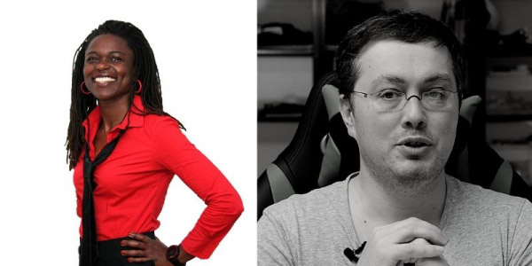

> Wir ermöglichen Kindern den eigenen Diamanten zu entdecken

## Melde Dich an

Du oder deine Kinder wollten immer die Grundlagen des Programmierens kennenlernen?
Ihr wollt endlich Roboter steuern?
Kein Problem. In unserem Kurs lernt ihr genau das. Karel ist eine Programmiersprache die euch das Leben in der Welt von Java, Python, C# and Co. leichter macht.
Je nach Anmeldungen führen wir den Kurs in Deutsch oder in English. Nur keine Angst, wir werden uns auf jeden Fall verstehen.

Wähle deinen Tag und deine Uhrzeit:

- am 20.11. um 10:00 Uhr starten wir mit neugierigen Kindern,
- am 20.11. um 16:00 Uhr ist der Kurs nur für alle ab 18 Jahre.
- am 21.11. bieten wir den Kurs für Kinder und Erwachsene.

Bist du negierig? Wir freuen uns sehr auf dich.

Falls Du noch fragen hast, melde Dich gerne bei uns: **coding4future.gbr@gmail.com**.
Susan und Christian helfen gerne weiter.

You or your children have always wanted to learn the basics of programming? You like puzzles and want to control robots? No problem. In our course you will learn the core concepts of programming with Karel.



The [Karel programming language](https://en.wikipedia.org/wiki/Karel_(programming_language)) is a cool introduction to the world of programming and makes it much easier to get started in the world of Java, Python, C# and Co. We let the robot Karel wander through a labyrinth  and solve puzzles together.

## What you need

- curiosity, joy of learning, also from mistakes and you are at least 12 years old (12 to 99 years old)
- computer and a stable internet connection
- school english skills

Do not worry, we can always switch to German, Romanian or in Swahili. Our inspirers will take care of each of you.

## Program

- Introduction to the programming language Karel
- Do it and learn: Let robot Karel wander too far through labyrinth and puzzle together

Are you with us? We are looking forward to cool-coding with you.

## Who are we?

- [Susan Omondi](https://www.linkedin.com/in/susanomondi/)
- [Christian Trutz](https://www.linkedin.com/in/christiantrutz/)

## Inspirer

- [Billy Ramogi](https://www.linkedin.com/in/billyramogi/) (Software developer)
- [Christian Trutz](https://www.linkedin.com/in/christiantrutz/) (Software developer)
